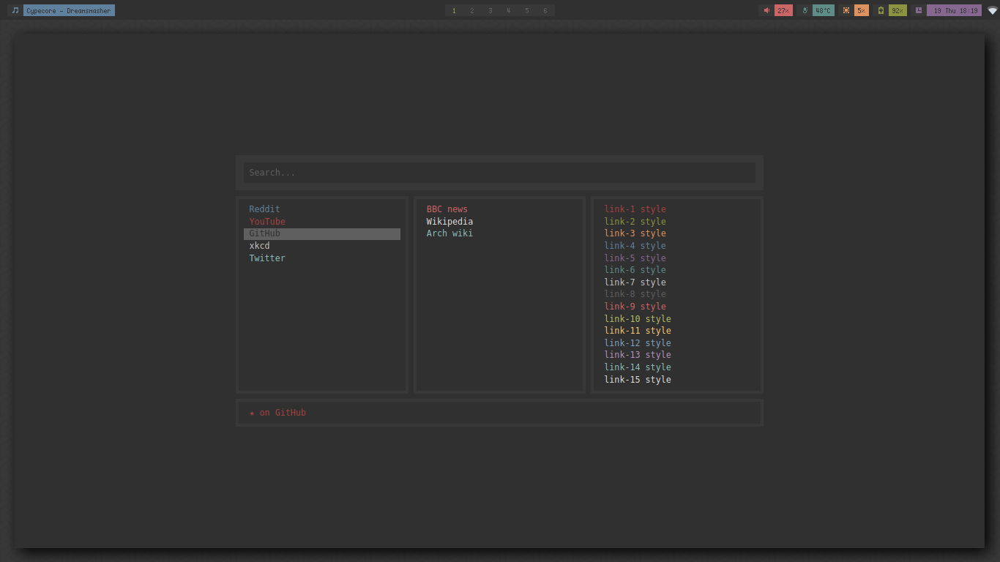

# Ranger ispired homepage

This is ranger ispired browser homepage. It supports vim like navigation and Google suggestions. It is compatible with [pywals](https://github.com/dylanaraps/pywal) colors.css.

Try it here: [live preview](https://kjaklinovic.github.io/homepage/).

### Usage

Page has autofocus of search box. When you start typing Google suggestions will appear. Navigate through suggestions using
<kbd>↑</kbd> <kbd>↓</kbd> <kbd>←</kbd> <kbd>→</kbd> keys.

Press <kbd>TAB</kbd> when search bar is focused to focus the area bellow. Navigate throught the links using <kbd>↑</kbd> <kbd>↓</kbd> <kbd>←</kbd> <kbd>→</kbd> keys or <kbd>h</kbd> <kbd>j</kbd> <kbd>k</kbd> <kbd>l</kbd> for vim like experience.

#### Alternate search engine
The page supports Google and DuckDuckGo search with autocompletion.

To configure the search engine simply edit the `SEARCH_ENGINE` variable on line 6 in `index.js`. Set it to either `SEARCH_ENGINES.GOOGLE` (_default_) or `SEARCH_ENGINES.DUCKDUCKGO`.

### TODO
- [ ] Add custom commands
- [ ] Integrate weather API
- [ ] Implement clock
- [ ] Implement TODO pane
- [ ] Customizeable homepage build

